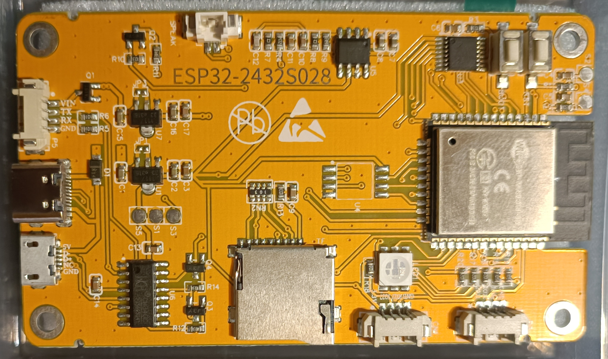
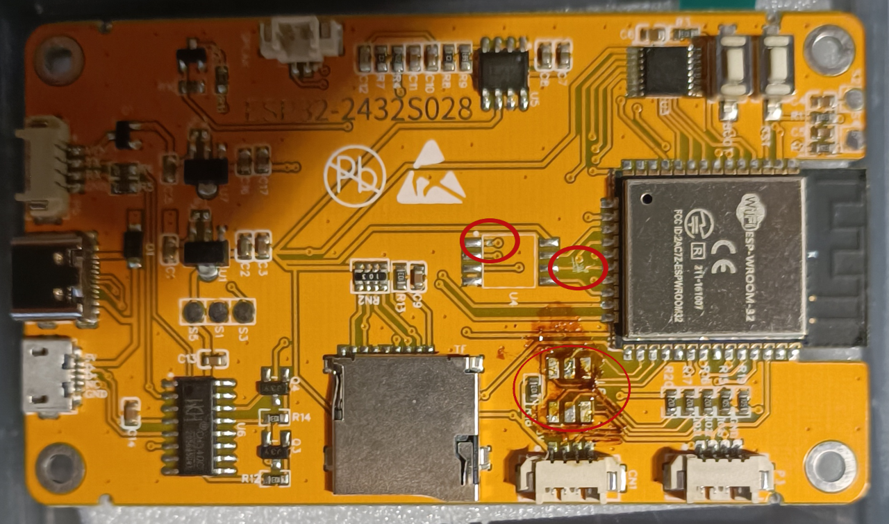
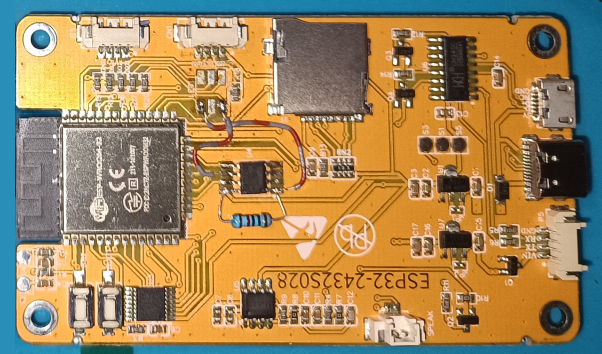
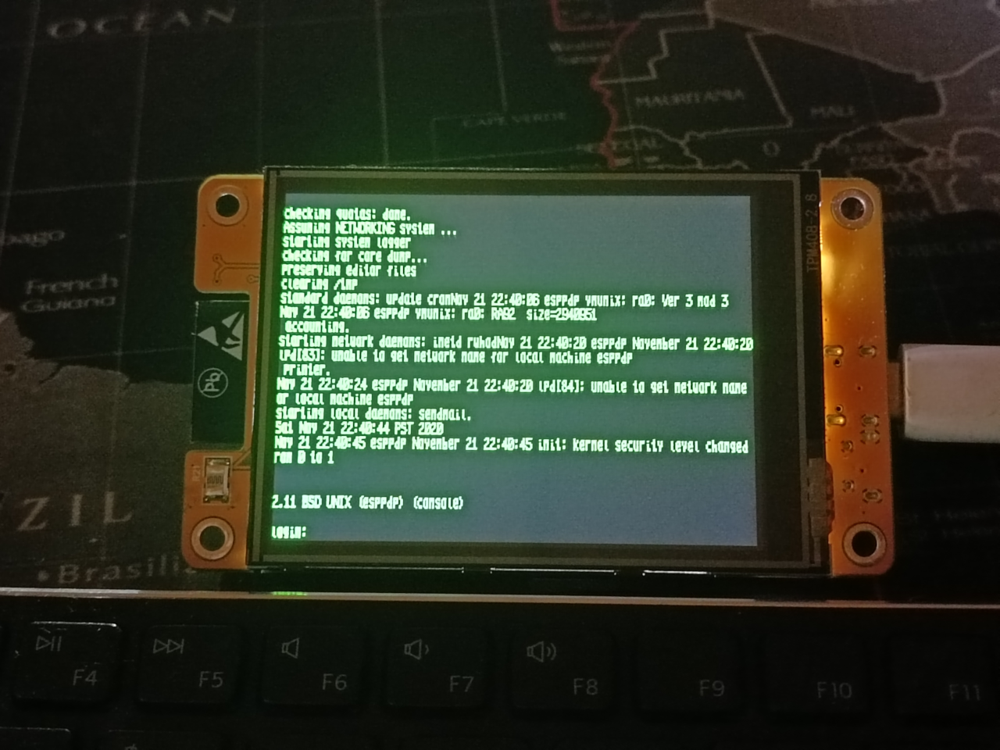

# Sunton ESP32 2832S028

The Sunton ESP32 2832S028 is avaiable for very cheap and integrates most of the needed hardware to run this PDP11 emulator.
Unfortunately they decided not to include PSRAM, so we have to add it to the board. But it is not that complicated.

I only have the newer version of this board with a ST7789 display, so you are are bit on yourself if you want to use the
older version with ILI9341, since the board layout changed.

## Modifications

Board before modification:

You have to remove the RGB-led and cut two lines:

Now you can solder the PSRAM chip and add lines to the IO16, IO17 exposed on the former led place. Also add 10k pull-up as you can see here:

## flash firmware

after flashing the firmware and inserting the sdcard with the harddrive image, BSD 2.11 will boot:

